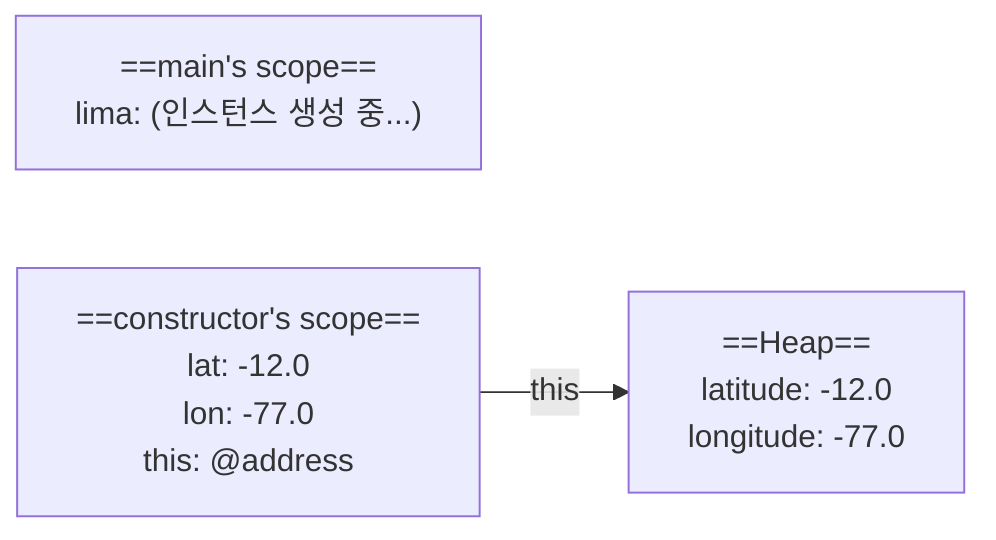
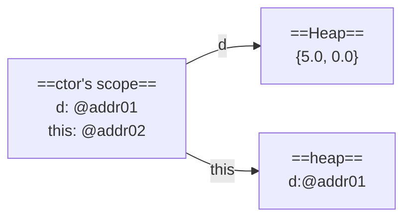
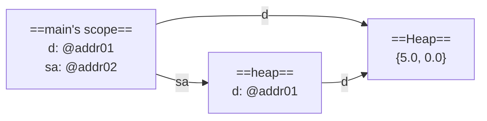
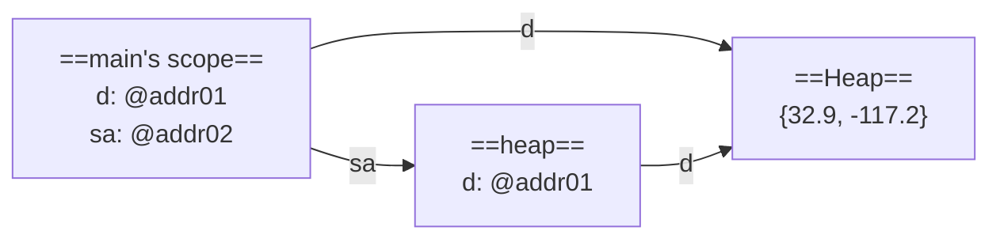

# variable Scope

```java
public class SimpleLocation {
    public double latitude;
    public double longitude;
    public SimpleLocation(double lat, double lon) {
        this.latitude = lat;
        this.longitude = lon;
    }
}

public class LocationTester {
    public static void main(String[] args) {
        SimpleLocation lima = new SimpleLocation(-12.0, -77.0);
    }
}
```



생성자 메서드가 끝나면 constructor's scope도 사라짐(메모리에서 삭제)
그 안의 변수도 더 이상 사용 불가

this라는 키워드를 쓰지 않아도 됨 (자바에서 별로 유용하지 않다고 함)
```java
public SimpleLocation(double lat, double lon) {
    latitude = lat;
    longitude = lon;
}
```
우선 latitude라는 변수가 constructors's local scope에 있는지 확인하고,
없으면 자동으로 object scope에서 확인하기 때문


### Array
array도 primitive type이 아니라 object type이기 때문에 변수의 메모리 공간에 저장되는 것은 오직 heap의 위치 주소가 있는 reference뿐임
int[] myArray = {5, 10};


public class SampleArray {
​	private double d[];
​	public ArrayLocation(double[] d) {
​		this.d = d;
​	}

	public static void main(String[] args) {
		double[] d = {5.0, 0.0};
		SampleArray sa = new SampleArray(d);
		d[0] = 32.9;
		d[1] = -117.2;
		System.out.println(sa.d[0]);
	}
}


생성자가 main's scope의 변수 d를 매개변수로 사용
main 변수 d(매개변수)의 reference를 heap의 SampleArray 인스턴스 변수 d에 복사!
this의 reference를 변수 sa에 복사!

**line 9의 memory model**


line 9까지 실행한 후 생성자가 사라지면,



main 메소드에 있는 변수 d와 sa의 인스턴스 변수 d는 메모리의 다른 위치에 할당되어 있지만 reference는 같음

line 11까지 실행하면,



위와 같이 d[0], d[1] 값이 바뀜
최종적으로, `System.out.println(sa.d[0]);` 의 실행결과는
memory model의 화살표를 따라가보면됨
sa -> d -> [0] : `32.9`

getter나 setter도 쓰지 않고, 인스턴스 변수를 직접 변경하지 않았는데도 변수의 값이 바뀜 => 의도치 않은 결과가 나올 수 있어서 위험!! object type을 쓸 때 주의해야 함
